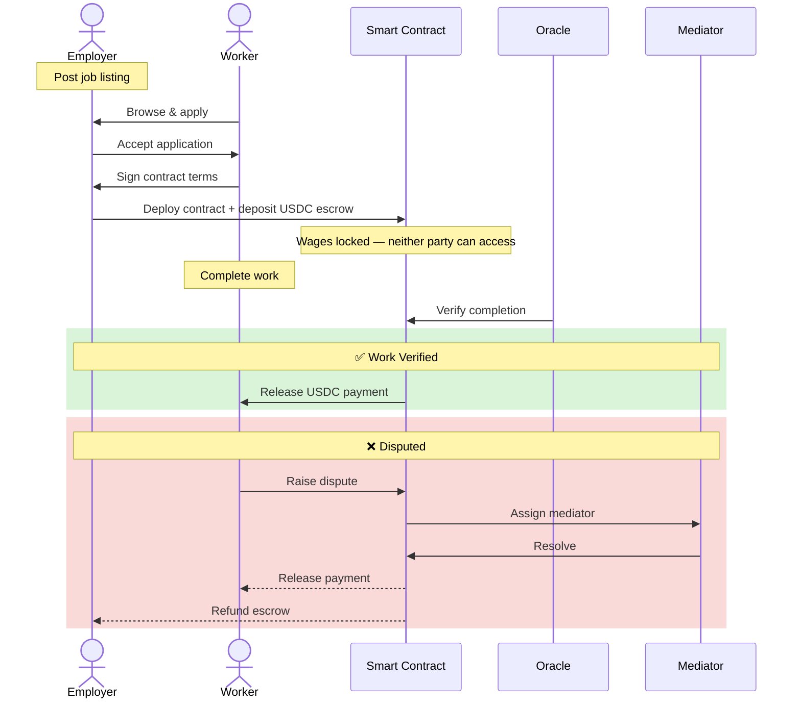

# GWU InnovationFest Poster Plan
**Date:** April 6, 2026
**Format:** 3ft × 4ft portrait (36" wide × 48" tall)
**Tool:** Canva

---

## Tool Recommendation: Canva

Canva is faster to iterate, easier for students to collaborate on, handles images and diagrams without friction, and produces a more polished result for a public-facing demo event than a typesetting tool like Typst.

---

## Brand Colors

- **Navy:** `#0D3B66`
- **Orange:** `#EE964B`
- White background for body sections

---

## Layout

```
┌──────────────────────────────────────────────────────┐
│  HEADER                         36" wide × 7" tall   │
│  [Logo] LucidLedger                                  │
│  "Putting Wages in Escrow Before Work Begins"        │
│  George Washington University · InnovationFest 2026  │
├────────────────────┬─────────────────────────────────┤
│  THE PROBLEM       │  HOW WE SOLVE IT                │
│  18" wide × 16"    │  18" wide × 16" tall            │
│  tall              │                                 │
│  [stats]           │  [bullets]                      │
├────────────────────┴──────────────┬──────────────────┤
│  SYSTEM FLOW DIAGRAM              │  TECH STACK      │
│  24" wide × 14" tall              │  12" wide ×      │
│                                   │  14" tall        │
│  [Mermaid diagram]                │  [table]         │
├───────────────────────────────────┴──────────────────┤
│  FOOTER                         36" wide × 11" tall  │
│  TRY IT NOW  [QR code]  lucidledger.com              │
│  "Sign in as a worker, browse jobs, apply"           │
│                                                      │
│  Open Source · Built at George Washington University │
│  github.com/worker-dapp/lucidledger · ejt@gwu.edu    │
└──────────────────────────────────────────────────────┘
```

Total: 7 + 16 + 14 + 11 = 48"

---

## Section-by-Section Content Guide

### HEADER — 36" wide × 7" tall

- **Title:** LucidLedger
- **Subtitle:** *Blockchain-Backed Wage Protection for Global Workers*
- **Tagline (smaller):** *Putting wages in escrow before work begins — making wage theft structurally impossible*
- GWU logo + "InnovationFest 2026" in small text

---

### THE PROBLEM — 18" wide × 16" tall

Pick 3–4 of the most striking stats. Each as a large number + one line of context. No paragraphs.

> **$11.85 billion** in wages and severance went unpaid in the global garment sector during COVID alone.

> **~58%** of covered workers in Sub-Saharan Africa are paid below the legal minimum wage.

> **170 million** migrant workers face recruitment fee exploitation — the most common form of forced labor in global supply chains.

> In Nigeria, only **1% of workers** who experience wage violations pursue legal recovery.

---

### HOW WE SOLVE IT — 18" wide × 16" tall

Short bullets only:

- USDC wages held in smart contract escrow **before work begins**
- Work completion verified by **configurable oracles**
- On-chain **dispute resolution** via neutral mediator
- Workers need **no crypto knowledge** — no ETH, no wallet setup required
- Gas-free transactions: **platform sponsors all fees** via Account Abstraction

---

### SYSTEM FLOW DIAGRAM — 24" wide × 14" tall

The Mermaid source below is the authoritative draft. To render it:
1. Go to https://mermaid.live
2. Paste the code block below into the editor on the left
3. The diagram will render on the right — click the download button to export as SVG
4. In Canva: Insert → Upload → select the SVG file

SVG exports from mermaid.live are crisp at any print size.

Use the diagram below for both the poster and the website (`NewAbout.jsx`) — see `website-content-critique-2026-04-06.md`.

#### Full version (for website and poster)



---

### TECH STACK — 12" wide × 14" tall

| Layer | Stack |
|---|---|
| Frontend | React, Vite, Tailwind CSS |
| Backend | Node.js, Express, PostgreSQL |
| Database | AWS RDS (PostgreSQL) |
| Blockchain | Base L2, Solidity, USDC |
| Auth | Privy (email, phone, wallet) |
| Payments | USDC + Account Abstraction (Coinbase Smart Wallet) |
| Infra | Docker, nginx, GitHub Actions CI/CD |

---

### FOOTER — 36" wide × 11" tall

Left or center: large scannable QR code (at least 3" × 3"), URL printed below, and demo instructions:

> *Sign in with your email, browse posted jobs, and submit an application.*
> This is a demo environment — feel free to explore.

Below that:

> **Open Source · Built at George Washington University**
> `github.com/worker-dapp/lucidledger` · `ejt@gwu.edu`

---

## Key Items to Confirm Before Students Start

1. **QR code** — Make sure it works and points to the `https://lucidledger.co` before printing
2. **Flowchart** — render the Mermaid diagram at `https://mermaid.live` or some similar site and export as an image (SVG or PNG); make sure it looks good before printing
3. **Demo accounts** — pre-create a sufficient number of active job postings and fund with test USDC so walk-up visitors have something to apply to
4. **Print timing** — confirm print timing with library, submit in time for April 30 session

---

## What NOT to Do

- Do not crowd sections with paragraphs — every section should be skimmable in under 10 seconds
- Do not make the QR code small — it should be the most-used element at the booth
